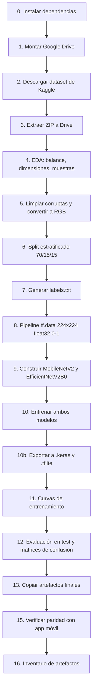
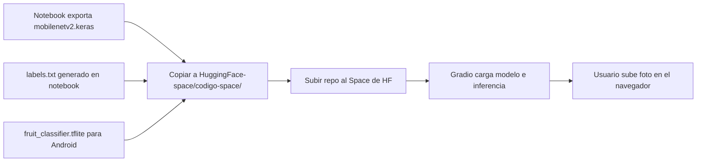

# Clasificador de frutas y verduras

Sistema de visión por computador que identifica **20 clases** de alimentos: 5 frutas y 5 verduras, cada una en estado **fresco** o **podrido**. El proyecto incluye el entrenamiento completo en un notebook (Google Colab), exportación del modelo para uso móvil y una demo web desplegada en Hugging Face Spaces.

---

## Objetivo

Construir un clasificador de imágenes robusto y desplegable que permita:

1. **Entrenar y comparar** dos arquitecturas de transfer learning (MobileNetV2 y EfficientNetV2B0) sobre un dataset público de Kaggle.
2. **Exportar** el mejor modelo a formatos listos para producción (`.keras` y `.tflite`).
3. **Demostrar** el modelo en una interfaz web accesible sin instalación local.

El caso de uso principal es ayudar a distinguir visualmente si una fruta o verdura está en buen estado o en descomposición, útil en contextos de control de calidad, educación o prototipos de apps móviles.

---

## Demo en vivo

Prueba el clasificador subiendo una foto o usando la cámara:

**[Hugging Face Space — Mobilenetv2 FruitClassifier](https://huggingface.co/spaces/JoseEnrique14/mobilenetv2-fruitClassifier)**

---

## Estructura del repositorio

```
CLasificador-frutas/
├── Clasificador_frutas.ipynb   # Pipeline completo: datos → entrenamiento → exportación
├── app.py                      # Demo Gradio local (misma lógica que el Space)
├── data/
│   ├── raw/                    # ZIP original (descarga manual, ver enlaces abajo)
│   └── processed/              # Dataset descomprimido (descarga manual)
├── HuggingFace-space/
│   └── codigo-space/           # Archivos desplegados en el Space de HF
│       ├── app.py
│       ├── mobilenetv2.keras
│       ├── fruit_classifier.tflite
│       ├── labels.txt
│       └── requirements.txt
└── metodologia.md              # Fases del proyecto académico
```

---

## Presentación del proyecto

Esta sección resume el flujo completo del notebook y lo que ocurre después con Hugging Face. Está pensada como una presentación de 5–7 minutos.

### 1. Problema

En almacenes, mercados y hogares es frecuente descartar alimentos que aún están en buen estado, o conservar productos que ya se deterioraron. Un clasificador visual puede apoyar esa decisión de forma rápida a partir de una sola fotografía.

**Pregunta que responde el modelo:** ¿Qué fruta o verdura es y está fresca o podrida?

### 2. Datos

| Aspecto | Detalle |
|---|---|
| **Fuente** | [Fruits and Vegetables Dataset](https://www.kaggle.com/datasets/muhriddinmuxiddinov/fruits-and-vegetables-dataset) (Kaggle) |
| **Contenido** | 10 clases de frutas + 10 clases de verduras |
| **Estados** | Fresco / Podrido por cada alimento |
| **Total de clases** | 20 |
| **Alimentos** | Manzana, banano, mango, naranja, fresa, pimentón, zanahoria, pepino, papa, tomate |

El notebook descarga el dataset desde Kaggle, lo extrae en Google Drive y valida que existan las 20 carpetas esperadas antes de entrenar.

**Descarga manual (si no usas Colab):**

- Datos crudos (ZIP): [Google Drive](https://drive.google.com/file/d/1fHekuVyGXGWWG1GclqA1kOTPXn_eFnhB/view?usp=sharing) → colocar en `data/raw/`
- Datos procesados: [Google Drive](https://drive.google.com/drive/folders/1Vw6MT6UeLvhyA9p0oAzKa4UbsmCIaBQ9?usp=sharing) → colocar en `data/processed/`

### 3. Proceso del notebook (`Clasificador_frutas.ipynb`)

El notebook es el corazón del proyecto. Sigue un pipeline secuencial de 17 bloques:



#### Fase exploratoria (bloques 0–5)

1. **Configuración:** TensorFlow ≥ 2.16, Keras 3, semilla fija (`SEED=42`) para reproducibilidad.
2. **Persistencia en Drive:** Los datos, checkpoints y artefactos se guardan en Drive para no perder progreso si Colab se reinicia.
3. **Descarga idempotente:** Si el ZIP ya existe, no se vuelve a descargar.
4. **EDA:** Se analiza balance por clase, dimensiones de imagen, modos de color y se muestran ejemplos visuales.
5. **Integridad:** Se eliminan imágenes corruptas y se convierten las que no son RGB.

#### Fase de modelado (bloques 6–10)

6. **Partición de datos:** Split estratificado **70 % train / 15 % val / 15 % test** sobre las 20 clases.
7. **Etiquetas legibles:** Se genera `labels.txt` con nombres en español (p. ej. `Manzana Fresca`, `Tomate Podrido`).
8. **Pipeline de entrada:** Imágenes **224×224**, **RGB**, **`float32` en [0, 1]** — formato compatible con inferencia móvil.
9. **Dos modelos baseline** con transfer learning desde ImageNet:

   | Modelo | Parámetros | Ventaja principal |
   |---|---|---|
   | **MobileNetV2** | ~3.5 M | Ligero, rápido, ideal para móvil y TFLite |
   | **EfficientNetV2B0** | ~7.1 M | Mayor precisión en datasets medianos |

10. **Receta de entrenamiento (igual para ambos):**
    - **Fase 1 — cabeza congelada:** hasta 20 épocas, Adam `lr=1e-3`, EarlyStopping.
    - **Fase 2 — fine-tuning:** descongela últimas 40 capas, hasta 15 épocas, Adam `lr=1e-5`.
    - Augmentación: flip, rotación, zoom, traslación, contraste y brillo.
    - `class_weight='balanced'`, `ReduceLROnPlateau`.

#### Fase de evaluación y exportación (bloques 10b–16)

11. **Comparación en test:** accuracy, top-3, macro F1, matriz de confusión.
12. **Selección del ganador:** el modelo con mejor accuracy en validación/test.
13. **Artefactos generados** (en la carpeta `artifacts/` de Drive):

    | Archivo | Uso |
    |---|---|
    | `mobilenetv2.keras` | Modelo Keras completo (demo web, reentrenamiento) |
    | `mobilenetv2.tflite` | Inferencia optimizada para Android |
    | `fruit_classifier.tflite` | Copia del ganador con nombre estándar para la app |
    | `labels.txt` | Mapeo índice → nombre legible |
    | `training_curves.png` | Curvas loss/accuracy |
    | `metrics_summary.json` | Métricas comparativas |

14. **Verificación de paridad:** El notebook simula el preprocesamiento de la app Android (RGB → resize 224 → `/255` → float32) y confirma que el `.tflite` produce las mismas predicciones.

### 4. Del notebook a Hugging Face

Una vez entrenado el modelo, el flujo de despliegue web es:



**Qué contiene el Space** (`HuggingFace-space/codigo-space/`):

- `app.py` — interfaz Gradio que carga `mobilenetv2.keras` y `labels.txt`.
- `mobilenetv2.keras` — pesos del modelo ganador.
- `fruit_classifier.tflite` — mismo modelo en formato TFLite (referencia para móvil).
- `requirements.txt` — dependencias del Space (`gradio`, `tensorflow`, `keras`, `pillow`).

**Flujo de inferencia en la demo web:**

1. El usuario sube o captura una imagen.
2. La app redimensiona a 224×224 y aplica el preprocesamiento de MobileNetV2.
3. El modelo devuelve probabilidades para las 20 clases.
4. Gradio muestra las **3 predicciones más probables** con etiquetas en español.

### 5. Lecciones aprendidas

- **Persistir en Drive** evita perder horas de entrenamiento cuando Colab reinicia el runtime.
- **Unificar el preprocesamiento** entre notebook, TFLite y demo web reduce errores silenciosos en producción.
- **Comparar dos arquitecturas** con la misma receta de entrenamiento permite elegir con criterio entre precisión y tamaño/latencia.
- **MobileNetV2** suele ser la mejor opción cuando el objetivo incluye despliegue móvil y demo web ligera.
- **Validar con imágenes reales** (fuera del dataset) sigue siendo necesario: iluminación, fondo y ángulo afectan mucho al resultado.

---

## Instalación

### Requisitos

- Python 3.10 o superior
- GPU recomendada para entrenar (Google Colab con T4 es suficiente)
- Cuenta de Kaggle con token de API (solo para descargar el dataset desde el notebook)

### Entorno local para la demo Gradio

```bash
git clone https://github.com/<tu-usuario>/CLasificador-frutas.git
cd CLasificador-frutas

python -m venv .venv
# Windows
.venv\Scripts\activate
# Linux / macOS
source .venv/bin/activate

pip install gradio "tensorflow>=2.16" "keras>=3.0" pillow
```

Copia el modelo y las etiquetas al directorio raíz (o usa los que ya están en `HuggingFace-space/codigo-space/`):

```bash
copy HuggingFace-space\codigo-space\mobilenetv2.keras .
copy HuggingFace-space\codigo-space\labels.txt .
```

### Entorno para entrenar (notebook)

Abre `Clasificador_frutas.ipynb` en Google Colab con runtime GPU. El notebook instala automáticamente:

```
tensorflow>=2.16, keras>=3.3, scikit-learn, matplotlib, seaborn,
prettytable, Pillow, imagehash, kaggle
```

Configura tu token de Kaggle antes de ejecutar la celda de descarga (variable de entorno `KAGGLE_API_TOKEN` o archivo `~/.kaggle/access_token`).

---

## Ejecución local

### Demo web con Gradio

Desde la raíz del proyecto (con `mobilenetv2.keras` y `labels.txt` presentes):

```bash
python app.py
```

Abre la URL que muestra la terminal (normalmente `http://127.0.0.1:7860`). Sube una foto de una fruta o verdura y revisa las 3 clases más probables.

### Entrenamiento completo

1. Abre `Clasificador_frutas.ipynb` en Colab.
2. Monta Google Drive y ejecuta las celdas en orden (0 → 16).
3. Tiempo estimado en GPU T4: **35–50 minutos** (ambos modelos).
4. Al finalizar, los artefactos quedan en `MyDrive/Proyecto_ML_Frutas_Verduras/artifacts/`.

---

## Ejemplos de uso

| Escenario | Qué hacer |
|---|---|
| Probar sin instalar nada | Abrir el [Space de Hugging Face](https://huggingface.co/spaces/JoseEnrique14/mobilenetv2-fruitClassifier) y subir una foto |
| Demo local rápida | `python app.py` con el modelo copiado en la raíz |
| Reentrenar o comparar modelos | Ejecutar el notebook completo en Colab |
| Integrar en Android | Copiar `fruit_classifier.tflite` y `labels.txt` a `app/src/main/assets/` |

**Clases que reconoce el modelo:**

| Frutas frescas | Frutas podridas | Verduras frescas | Verduras podridas |
|---|---|---|---|
| Manzana Fresca | Manzana Podrida | Pimentón Fresco | Pimentón Podrido |
| Banano Fresco | Banano Podrido | Zanahoria Fresca | Zanahoria Podrida |
| Mango Fresco | Mango Podrido | Pepino Fresco | Pepino Podrido |
| Naranja Fresca | Naranja Podrida | Papa Fresca | Papa Podrida |
| Fresa Fresca | Fresa Podrida | Tomate Fresco | Tomate Podrido |

---

## Limitaciones

- **Dominio cerrado:** Solo reconoce las 20 clases del dataset; objetos, platos o alimentos no incluidos pueden clasificarse incorrectamente con alta confianza.
- **Condiciones de captura:** Fondos muy distintos, poca luz, oclusión parcial o fotos borrosas degradan la precisión.
- **Estados intermedios:** El modelo distingue “fresco” vs “podrido”, no grados intermedios de maduración o deterioro.
- **Sesgo del dataset:** Las métricas reflejan las imágenes de Kaggle; en entornos reales puede requerirse fine-tuning adicional.
- **Tamaño del repositorio:** Los datos y modelos grandes no están versionados en Git; hay que descargarlos desde los enlaces indicados o generarlos con el notebook.
- **Demo web vs móvil:** La app Gradio usa preprocesamiento Keras estándar; la app Android usa el flujo TFLite con tensor `[0, 1]`. Ambos están alineados en el notebook, pero conviene validar con fotos propias en cada plataforma.

---

## Licencia

Ver [LICENSE](LICENSE).
